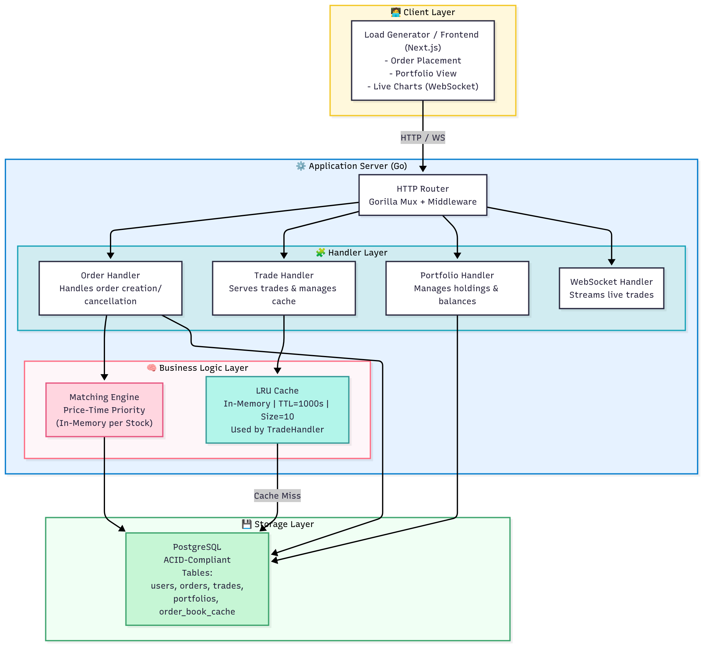
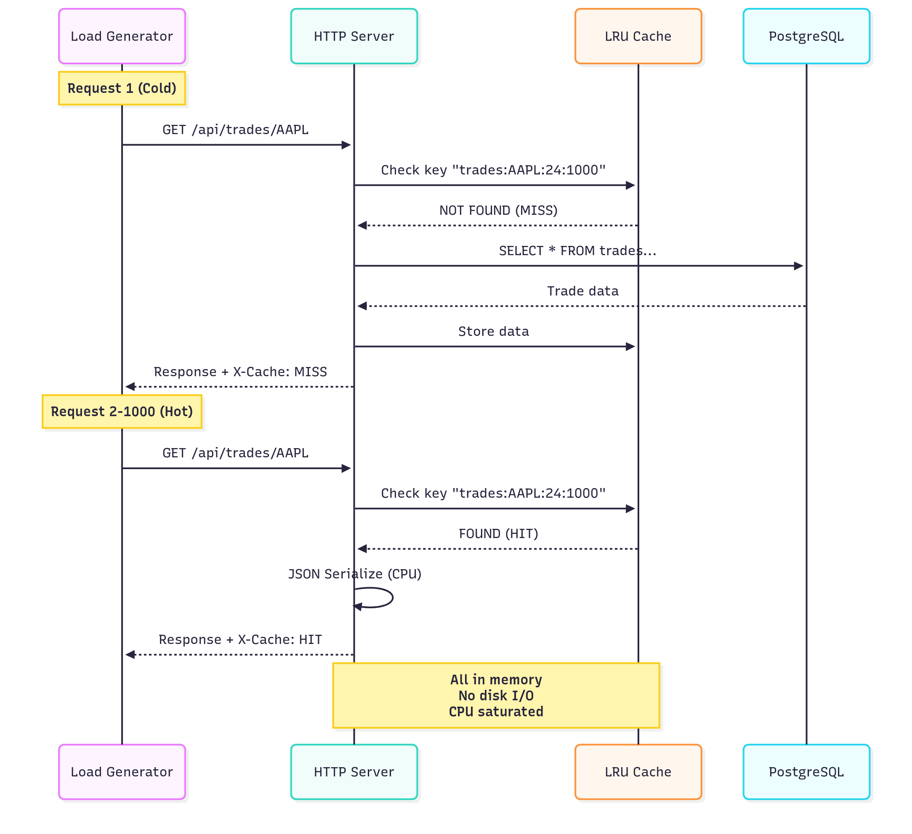
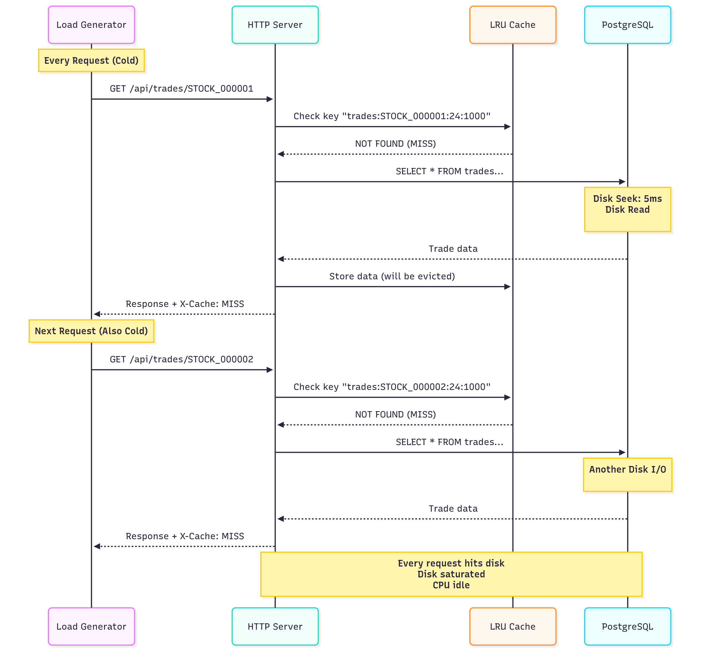

# CS744 Phase 1 Submission - High-Performance Trading System

**Student Name**: Asmit Kumar
**Roll Number**: 25M0794
**Course**: CS744 Autumn 2025

---

## 📦 GitHub Repository

**Repository Link**: `https://github.com/YooShijin/TradingPlatform`

---

## 🎯 System Overview

### Brief Description

A **real-time stock trading platform** built with Go that implements a complete electronic stock exchange. The system features:

- **Order Matching Engine**: In-memory price-time priority algorithm matching buy/sell orders instantly
- **Portfolio Management**: Real-time tracking of user holdings, balances, and profit/loss
- **Intelligent Caching**: LRU cache with configurable size and TTL for performance optimization
- **Real-time Updates**: WebSocket support for live trade notifications
- **Load Testing Capabilities**: Designed to demonstrate distinct CPU-bound and I/O-bound workloads

The system processes thousands of trades per second while maintaining ACID guarantees through PostgreSQL transactions.

---

## 🏗️ System Architecture

### High-Level Architecture Diagram



### Multi-Tier Architecture

**Tier 1: Client/Load Generator**

- Multi-threaded load generator with configurable clients
- Closed-loop: waits for response before sending next request
- Zero think time for maximum load generation

**Tier 2: Application Server (Go)**

- HTTP server with goroutine-per-request concurrency
- LRU cache layer for frequent queries (in-memory)
- Business logic: Order matching, portfolio calculations
- Thread-safe data structures with mutex protection

**Tier 3: Database (PostgreSQL)**

- Persistent storage with ACID transactions
- Connection pooling (25 max connections)
- Indexed queries for fast lookups
- Disk-based storage (I/O bound)

---

## 📡 API Endpoints & Their Roles

### Trading Operations

| Endpoint                 | Method | Purpose               | Cache Behavior    |
| ------------------------ | ------ | --------------------- | ----------------- |
| `/api/order/place`       | POST   | Place buy/sell orders | Invalidates cache |
| `/api/orderbook/{stock}` | GET    | View pending orders   | Not cached        |
| `/api/order/{id}`        | DELETE | Cancel order          | Invalidates cache |

**Role**: Core trading functionality; entry point for all market activity

---

### Trade History (Primary Load Testing Endpoint)

| Endpoint              | Method | Purpose                    | Cache Behavior            |
| --------------------- | ------ | -------------------------- | ------------------------- |
| `/api/trades/{stock}` | GET    | Get trade history          | **CACHED** - Key endpoint |
| `/api/trades/recent`  | GET    | Recent trades (all stocks) | CACHED                    |

**Query Parameters**:

- `hours`: Time window (default: 24)
- `limit`: Max results (default: 1000)

**Cache Behavior**:

- **Cache HIT**: Returns from memory (CPU-bound)
- **Cache MISS**: Queries database (I/O-bound)
- **Cache Key**: `trades:{stock}:{hours}:{limit}`

**Role**: **Primary endpoint for demonstrating CPU vs I/O bound workloads**

---

### Portfolio Management

| Endpoint                   | Method | Purpose                     |
| -------------------------- | ------ | --------------------------- |
| `/api/portfolio/{user_id}` | GET    | Get user portfolio with P&L |

**Role**: User account management, performance tracking

---

### Cache Management (For Load Testing)

| Endpoint                 | Method | Purpose                    |
| ------------------------ | ------ | -------------------------- |
| `/api/cache/stats`       | GET    | Get cache hit/miss metrics |
| `/api/cache/clear`       | POST   | Clear all cache entries    |
| `/api/cache/reset-stats` | POST   | Reset hit/miss counters    |

**Role**: Monitor cache effectiveness; control cache between test runs

---

### Real-time Communication

| Endpoint     | Protocol  | Purpose                  |
| ------------ | --------- | ------------------------ |
| `/ws/trades` | WebSocket | Live trade notifications |

**Role**: Real-time market data feed for connected clients

---


## Workload 1: CPU-Bound (Hot Reads)

### Description

Queries for the **same 10 popular stocks repeatedly**, resulting in 99.9% cache hit rate. All requests served from memory, making the system CPU-bound.

### Request Pattern

```
Stocks: [AAPL, GOOGL, MSFT, AMZN, TSLA, META, NVDA, NFLX, BABA, ORCL]
Random selection with replacement
```

### Flow Diagram



## Workload 2: I/O-Bound (Cold Reads)

### Description

Queries for **unique stocks every time**, resulting in 0.3% cache hit rate. Every request hits database, making the system I/O-bound.

### Request Pattern

```
Request 1: GET /api/trades/STOCK_000001
Request 2: GET /api/trades/STOCK_000002
Request 3: GET /api/trades/STOCK_000003
...
All unique - no repeats!
```

### Flow Diagram



## ⚖️ Additional Workload: Mixed (Balanced)

### Description

50% cache hits, 50% cache misses. Demonstrates balanced load with both CPU and I/O pressure.


##  Key Implementation Details

### 1. LRU Cache Implementation

- **Data Structure**: HashMap + Doubly Linked List
- **Eviction Policy**: Removes least recently used when full
- **Thread Safety**: RWMutex for concurrent access
- **Time Complexity**: O(1) for get/set operations

### 2. Order Matching Algorithm

- **Strategy**: Price-Time Priority
- **Buy Orders**: MaxHeap (highest price first)
- **Sell Orders**: MinHeap (lowest price first)
- **Complexity**: O(log n) per order

### 3. Database Design

- **ACID Transactions**: All trades atomic
- **Indexes**: On stock_symbol, executed_at for fast queries
- **Connection Pool**: 25 max connections to prevent exhaustion

### 4. Concurrency Model

- **Goroutines**: One per HTTP request
- **Mutexes**: Protect shared state (matching engine, cache)
- **WebSocket Hub**: Separate goroutine for broadcasting

---

## 📚 Technical Stack

- **Language**: Go(Server) JavaScript(Next frontend)
- **Database**: PostgreSQL 
- **Libraries**: Gorilla Mux, Gorilla WebSocket
- **Cache**: Custom LRU (no external dependencies)
- **Concurrency**: Native Go goroutines and channels

